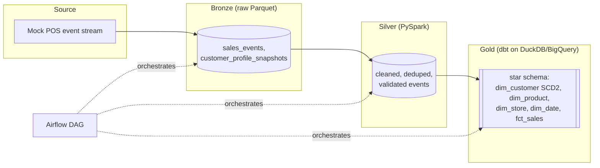

# Modern Data Lakehouse Platform

A medallion-architecture (Bronze / Silver / Gold) lakehouse simulation for retail
transaction events -- a mock streaming producer feeds a Parquet data lake, PySpark
cleans and validates it, dbt builds a dimensional model on top (including a real SCD
Type 2 customer dimension), Airflow orchestrates the whole thing, and Terraform
documents how it would actually be deployed on GCP.

**Start with the design doc, not the code:** [`docs/design.md`](docs/design.md) --
problem statement, ER diagrams (medallion data flow + Gold dimensional model), data
dictionary, and schema design rationale, written before any implementation file below.
The four ADRs in [`docs/adr/`](docs/adr/) cover the bigger architectural trade-offs.
[`docs/pipeline_health_report.md`](docs/pipeline_health_report.md) is a real, committed
output from actually running this pipeline end to end.

## Architecture



See `docs/design.md` §2 for the full entity-level diagrams.

## What's in this repo

| Path | What it is |
|---|---|
| `docs/` | Design doc + ADRs -- read this first. |
| `bronze/` | Mock streaming producer + reference data generator. Writes raw Parquet. |
| `silver/` | PySpark jobs cleaning/deduping/validating Bronze into Silver Parquet. |
| `gold/` | dbt project: staging models, dimensional marts, SCD2, data tests. |
| `orchestration/` | Airflow DAG coordinating Bronze → Silver → Gold. |
| `infra/` | Terraform for the production GCP deployment (documented, not applied). |
| `scripts/` | `pipeline_health_check.py` -- observability summary. |
| `tests/` | pytest unit tests for the PySpark transformation logic. |
| `.github/workflows/ci.yml` | Runs the unit tests + a full sample `dbt build` on every push. |
| `docker-compose.yml` | Local MinIO, for anyone who wants the fuller cloud-storage-shaped experience. |

## Skills demonstrated

SQL (dbt models, window functions, SCD2 logic), Python, PySpark (batch cleaning jobs,
unit-tested transformation logic), dbt (staging/marts layering, seeds, schema tests,
custom macros), Airflow (DAG design, sensors, parallel tasks, SLAs), data modeling (star
schema, SCD Type 2, data dictionaries), Infrastructure as Code (Terraform for BigQuery +
GCS), CI/CD (GitHub Actions running pytest + a full dbt build per commit), and data
quality/observability (Silver validation + quarantine, dbt tests, a pipeline health
report).

## Quickstart (run the whole pipeline locally)

Requires Python 3.10+, a JVM (PySpark dependency), and no cloud account.

```bash
pip install -r requirements.txt

# 1. Bronze: generate reference data + a batch of synthetic events
cd bronze
python reference_data.py
python producer.py --n-events 5000 --ingest-date 2026-07-24
cd ..

# 2. Silver: clean, dedupe, validate
export SPARK_LOCAL_IP=127.0.0.1   # avoids a hostname-resolution quirk in some sandboxes/containers
cd silver
python clean_transactions.py --lake-root ../data_lake
python clean_customers.py --lake-root ../data_lake
cd ..

# 3. Gold: build the dimensional model (DuckDB, zero cloud setup)
cd gold
cp profiles.yml.example profiles.yml
DBT_PROFILES_DIR=$(pwd) dbt build
cd ..

# 4. Inspect the result
python -c "
import duckdb
con = duckdb.connect('gold/lakehouse_gold.duckdb', read_only=True)
print(con.execute('select * from main_marts.mart_daily_store_sales limit 10').fetchdf())
"
```

Run the unit tests: `pytest tests/ -v`.

Re-running `producer.py` with a different `--ingest-date` and re-running steps 2-3
simulates another day's traffic -- some customers will drift to a new loyalty tier
(~4% chance per customer per day, by design -- see `bronze/producer.py`), which is what
gives `dim_customer_scd2` real day-over-day history to version.

## Notes on things that are simulated vs. real

This is a portfolio project, so a few things are deliberately simulated rather than
live -- each is documented rather than silently assumed:

- **No real Kafka/Pub-Sub** -- a Python generator stands in for the streaming source.
  See `docs/adr/0002-mock-streaming-vs-real-kafka.md` for exactly what would change to
  point this at a real broker.
- **No real cloud warehouse by default** -- Gold builds against local DuckDB so
  `dbt build` works with zero cloud setup. A BigQuery target is documented (commented
  out) in `gold/profiles.yml.example`, matching the datasets `infra/bigquery.tf`
  provisions. See `docs/adr/0003-duckdb-vs-bigquery-for-dbt.md`.
- **Terraform is not applied** -- `infra/` is real, reviewable IaC for the production
  GCP deployment, but there's no live GCP project behind this portfolio repo. See
  `infra/README.md`.
- **Airflow isn't bundled** -- the DAG file is real and would run as-is against any
  Airflow deployment with this repo available at the configured `REPO_ROOT`, but this
  repo doesn't ship a full Airflow install (too heavy for a "clone and inspect" portfolio
  repo). See `orchestration/README.md`.

Everything else -- the producer, the PySpark cleaning logic, the dbt models and tests,
the SCD2 mechanics, the sample data and health report in this repo -- is real, working
code that was actually run to produce the committed output.
