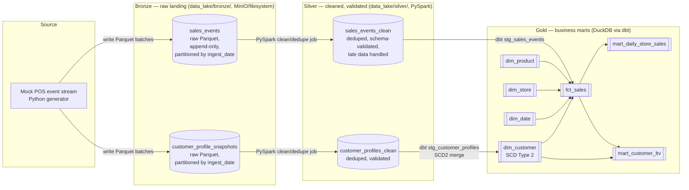
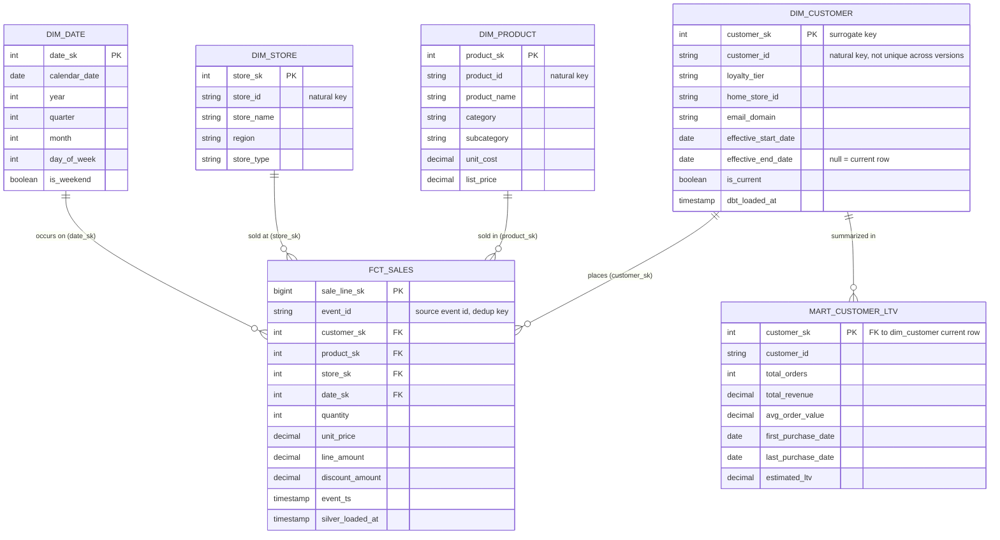
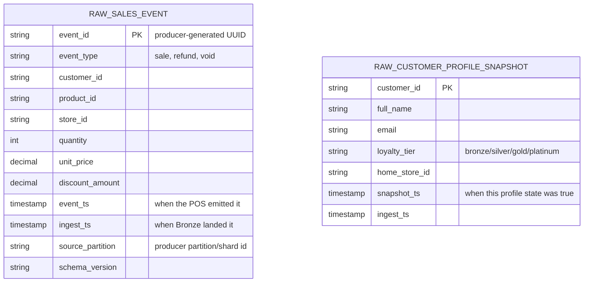

# Design — Modern Data Lakehouse Platform

This is the design-first document for the capstone project. It is written and committed
**before** any implementation code, in line with the rest of this portfolio's workflow:
design the data model and contracts first, then build against them.

## 1. Problem / requirements statement

**Business question:** A mid-size multi-store retailer needs a single, trustworthy source
of truth for sales analytics — daily revenue by store/product, customer purchase history
with accurate "as-of" attributes (e.g. what loyalty tier a customer was in *at the time*
of a given sale), and inventory/product reference data — built from a continuous stream
of raw point-of-sale (POS) events rather than a nightly batch dump.

**Who uses it:**
- **Analytics engineers / BI developers** query the Gold layer (dbt marts) to build
  dashboards (revenue trends, store performance, customer segments).
- **Data scientists** read Silver (clean, deduplicated, schema-validated events) for
  feature engineering, without needing to know raw Bronze quirks.
- **Data engineers** own Bronze → Silver → Gold and the orchestration/CI that keeps it
  running and observable.

**Why a medallion lakehouse instead of a single ETL script:** the source system emits
events continuously and imperfectly (duplicates, late-arriving records, occasional
malformed payloads), and customer attributes change over time (loyalty tier, home
store, marketing segment). A single flat "load and query" table can't represent
either of those honestly. Medallion layering isolates raw fidelity (Bronze), enforced
correctness (Silver), and business semantics + history (Gold) so that each concern is
solved once, in one place, instead of re-solved inside every downstream query.

**Explicit non-goals for this portfolio project:** real Kafka/Pub-Sub infrastructure,
real cloud billing, and real PII. Every component that would normally be a managed
cloud service is either simulated locally (MinIO stands in for cloud object storage,
a Python generator stands in for a Kafka producer) or provided as reviewable-but-not-applied
Infrastructure as Code (Terraform). This is documented explicitly wherever it applies —
see `docs/adr/0002-mock-streaming-vs-real-kafka.md`.

## 2. Data flow / entity diagram

### 2.1 Medallion flow (Bronze → Silver → Gold)

### 2.2 Gold-layer entity relationships (dimensional model)

### 2.3 Bronze / Silver raw schemas (pre-dimensional, event-shaped)

## 3. Data dictionary

### 3.1 Bronze — `sales_events` (raw, append-only Parquet)

| Column | Type | Nullable | Description | Example |
|---|---|---|---|---|
| event_id | STRING | No | UUID assigned by the producer; used for de-duplication downstream | `a3f1...e9` |
| event_type | STRING | No | `sale`, `refund`, or `void` | `sale` |
| customer_id | STRING | Yes | Natural key of the purchasing customer; null for anonymous/cash sales | `CUST-004821` |
| product_id | STRING | No | Natural key of the product sold | `PROD-01923` |
| store_id | STRING | No | Natural key of the selling store | `STORE-07` |
| quantity | INT | No | Units sold (negative for refunds) | `2` |
| unit_price | DECIMAL(10,2) | No | Price per unit at time of sale | `129.90` |
| discount_amount | DECIMAL(10,2) | Yes | Line-level discount applied | `10.00` |
| event_ts | TIMESTAMP | No | POS-reported event time (source of truth for "when it happened") | `2026-07-20T14:32:01Z` |
| ingest_ts | TIMESTAMP | No | Time Bronze landed the record (system time, for lag monitoring) | `2026-07-20T14:32:05Z` |
| source_partition | STRING | No | Simulated producer shard/partition id, mirrors a Kafka partition key | `shard-2` |
| schema_version | STRING | No | Producer schema version tag, enables safe schema evolution | `v1` |

### 3.2 Bronze — `customer_profile_snapshots` (raw, append-only Parquet)

| Column | Type | Nullable | Description | Example |
|---|---|---|---|---|
| customer_id | STRING | No | Natural key | `CUST-004821` |
| full_name | STRING | No | Customer name (synthetic) | `Somchai P.` |
| email | STRING | Yes | Synthetic email | `somchai.p@example.com` |
| loyalty_tier | STRING | No | `bronze`, `silver`, `gold`, `platinum` | `gold` |
| home_store_id | STRING | Yes | Store the customer is registered at | `STORE-07` |
| snapshot_ts | TIMESTAMP | No | When this profile state became true (source-reported) | `2026-06-01T00:00:00Z` |
| ingest_ts | TIMESTAMP | No | When Bronze landed the record | `2026-06-01T00:05:00Z` |

### 3.3 Silver — `sales_events_clean`

| Column | Type | Nullable | Description | Example |
|---|---|---|---|---|
| event_id | STRING | No | Deduplicated on this key (keep latest `ingest_ts` per id) | `a3f1...e9` |
| event_type | STRING | No | Validated against allowed enum | `sale` |
| customer_id | STRING | Yes | FK-checked against known customers where present | `CUST-004821` |
| product_id | STRING | No | FK-checked against product reference data | `PROD-01923` |
| store_id | STRING | No | FK-checked against store reference data | `STORE-07` |
| quantity | INT | No | Range-validated (`!= 0`) | `2` |
| unit_price | DECIMAL(10,2) | No | Range-validated (`>= 0`) | `129.90` |
| discount_amount | DECIMAL(10,2) | No | Nulls coalesced to 0 | `10.00` |
| line_amount | DECIMAL(10,2) | No | Derived: `quantity * unit_price - discount_amount` | `239.80` |
| event_ts | TIMESTAMP | No | Carried through from Bronze | `2026-07-20T14:32:01Z` |
| silver_loaded_at | TIMESTAMP | No | When the Silver job processed this row | `2026-07-20T15:00:00Z` |
| is_late_arrival | BOOLEAN | No | `true` if `ingest_ts - event_ts` exceeds the lateness threshold | `false` |
| event_date | DATE | No | Derived from `event_ts`; the physical partition column | `2026-07-20` |

### 3.4 Silver — `customer_profiles_clean`

| Column | Type | Nullable | Description | Example |
|---|---|---|---|---|
| customer_id | STRING | No | Deduplicated, latest `snapshot_ts` wins per id per day | `CUST-004821` |
| full_name | STRING | No | Trimmed/normalized | `Somchai P.` |
| email | STRING | Yes | Lower-cased, format-validated | `somchai.p@example.com` |
| loyalty_tier | STRING | No | Validated against enum `{bronze,silver,gold,platinum}` | `gold` |
| home_store_id | STRING | Yes | FK-checked against store reference data | `STORE-07` |
| snapshot_ts | TIMESTAMP | No | Carried through from Bronze | `2026-06-01T00:00:00Z` |
| silver_loaded_at | TIMESTAMP | No | Processing timestamp | `2026-06-01T01:00:00Z` |
| snapshot_date | DATE | No | Derived from `snapshot_ts`; the physical partition column | `2026-06-01` |

### 3.5 Gold — `dim_customer` (SCD Type 2)

| Column | Type | Nullable | Description | Example |
|---|---|---|---|---|
| customer_sk | INT | No | Surrogate key, PK of this table | `10452` |
| customer_id | STRING | No | Natural key; repeats across versions of the same customer | `CUST-004821` |
| loyalty_tier | STRING | No | Tier as of this version | `gold` |
| home_store_id | STRING | Yes | Home store as of this version | `STORE-07` |
| email_domain | STRING | Yes | Derived, non-PII attribute kept instead of raw email | `example.com` |
| effective_start_date | DATE | No | First date this version was true | `2026-06-01` |
| effective_end_date | DATE | Yes | Last date this version was true; `NULL` = current | `2026-07-14` |
| is_current | BOOLEAN | No | Convenience flag, `true` for exactly one row per `customer_id` | `false` |
| dbt_loaded_at | TIMESTAMP | No | When dbt materialized this row version | `2026-07-15T02:00:00Z` |

### 3.6 Gold — `fct_sales`

| Column | Type | Nullable | Description | Example |
|---|---|---|---|---|
| sale_line_sk | BIGINT | No | Surrogate key, PK | `9081234` |
| event_id | STRING | No | Natural/dedup key from Silver | `a3f1...e9` |
| customer_sk | INT | Yes | FK → `dim_customer.customer_sk`, resolved to the version effective on `event_ts` | `10452` |
| product_sk | INT | No | FK → `dim_product.product_sk` | `301` |
| store_sk | INT | No | FK → `dim_store.store_sk` | `7` |
| date_sk | INT | No | FK → `dim_date.date_sk` | `20260720` |
| quantity | INT | No | Units sold | `2` |
| unit_price | DECIMAL(10,2) | No | Price per unit | `129.90` |
| discount_amount | DECIMAL(10,2) | No | Line discount | `10.00` |
| line_amount | DECIMAL(10,2) | No | Net line revenue | `239.80` |
| event_ts | TIMESTAMP | No | Original event time | `2026-07-20T14:32:01Z` |
| silver_loaded_at | TIMESTAMP | No | Carried through for lineage/debugging | `2026-07-20T15:00:00Z` |

## 4. Schema design

### 4.1 Grain decisions

- **Bronze** is event-grained and append-only — one row per raw POS event, no updates or
  deletes, ever. This preserves full raw history and makes Bronze replayable: Silver can
  always be rebuilt from Bronze if transformation logic changes.
- **Silver** is also event-grained (one row per de-duplicated `sales_events` record), but
  enforces a single current version of each `customer_profiles_clean` row per day — Silver
  removes noise, Gold adds business history.
- **`fct_sales`** in Gold is at **sale line grain** (one row per line item per event),
  matching Silver 1:1 so that facts never need re-aggregation to join to dimensions.
- **`dim_customer`** is SCD Type 2 at **(customer_id, effective date range) grain** —
  every change to `loyalty_tier` or `home_store_id` produces a new row rather than
  overwriting history, because "what tier was this customer at the time of purchase X"
  is a real question the business asks (e.g. tier-based commission attribution,
  cohort-accurate segment reporting).

### 4.2 Why star schema (not snowflake, not one big flat table) for Gold

A star schema (`fct_sales` + conformed dimensions) was chosen over a single flat
denormalized table because: (a) `dim_customer`'s SCD2 history would otherwise force
repeating full customer attribute history onto every sales row, bloating storage and
making dimension-only queries (e.g. "how many gold-tier customers do we have today")
awkward; (b) `dim_product` and `dim_store` change independently of sales volume and are
small reference tables — keeping them separate avoids reprocessing all fact history when
a store is renamed; (c) BI tools (Power BI/Tableau, both used elsewhere in this
portfolio) are built around star-schema semantic models, so this mirrors what Don
would actually hand to a BI layer in a real job. Snowflaking `dim_product` further
(e.g. separate `dim_category` table) was rejected as unnecessary normalization for a
reference table this small — the size and slow-changing nature of `dim_product` doesn't
justify the extra join.

### 4.3 Key design choices

- **Surrogate keys everywhere in Gold** (`customer_sk`, `product_sk`, etc.) instead of
  reusing natural keys as PKs, specifically because `dim_customer` needs multiple rows
  per natural key under SCD2 — a natural key can't be a PK in that model.
- **`fct_sales.customer_sk` resolves to the dimension version effective on `event_ts`**
  (not the current version), implemented in the SCD2 merge model
  (`gold/models/marts/dim_customer_scd2.sql`) plus a lookup in `fct_sales.sql` that joins
  on `event_ts BETWEEN effective_start_date AND COALESCE(effective_end_date, '9999-12-31')`.
  This is the whole point of SCD2 — get it wrong and every "as of" business question
  silently returns present-day attributes instead of historical ones.
- **`event_id` is carried as a natural/dedup key through every layer** so lineage and
  reprocessing are traceable end to end, and so Silver/Gold merges can be idempotent
  (re-running a batch doesn't create duplicate facts).
- **Bronze and Silver are Parquet on a filesystem/MinIO "lake"**, not a database, because
  the point of Bronze/Silver in a lakehouse is cheap, schema-flexible storage that Spark
  reads directly; **Gold is a real warehouse-style database (DuckDB via dbt)** because
  Gold is where business semantics, dimensional modeling, and BI-tool consumption live —
  see `docs/adr/0003-duckdb-vs-bigquery-for-dbt.md` for why DuckDB was chosen for this
  portfolio project over standing up a live BigQuery project.

## 5. See also

- `docs/adr/0001-medallion-architecture.md` — why medallion over a single-hop ETL
- `docs/adr/0002-mock-streaming-vs-real-kafka.md` — why a Python generator instead of real Kafka/Pub-Sub
- `docs/adr/0003-duckdb-vs-bigquery-for-dbt.md` — why DuckDB for Gold in this project
- `docs/adr/0004-scd2-merge-strategy.md` — SCD2 implementation trade-offs
- `README.md` — how to run the whole pipeline end to end
