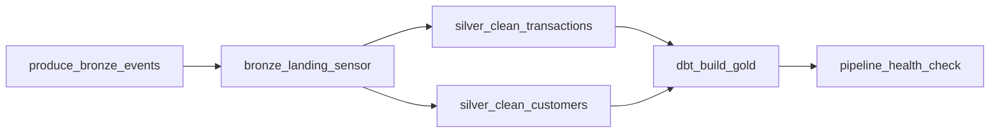

# Orchestration

`dags/lakehouse_medallion_dag.py` is the Airflow DAG coordinating the full
Bronze → Silver → Gold pipeline. See the module docstring in that file for the
task-by-task design rationale (why a sensor gates Silver, why Silver's two jobs run in
parallel, why retries/SLAs differ per task, etc).

## DAG graph

## Running it

This repo does not bundle a full Airflow install (that's a heavy dependency for a
portfolio repo to force on a reviewer). To run the DAG for real:

1. Stand up Airflow (e.g. the official `apache/airflow` docker-compose, or
   `pip install apache-airflow` in a virtualenv).
2. Mount or copy this repo into the Airflow container such that it's available at
   `/opt/airflow/repo` (matching `REPO_ROOT` in the DAG file), or edit `REPO_ROOT`.
3. Symlink or copy `dags/lakehouse_medallion_dag.py` into your Airflow `dags/` folder.
4. Ensure the Airflow worker's Python environment has this repo's dependencies
   installed (`pip install -r requirements.txt`, plus PySpark's Java requirement) and
   that `dbt` is on `PATH`.
5. Trigger the `lakehouse_medallion_pipeline` DAG from the Airflow UI or CLI.

## Design choices

- **`FileSensor` with `mode="reschedule"`** instead of `mode="poke"`, so the sensor
  releases its worker slot while waiting for Bronze to land instead of blocking a
  worker for up to 10 minutes.
- **Parallel Silver tasks**: `silver_clean_transactions` and `silver_clean_customers`
  are independent PySpark jobs reading different Bronze datasets, so they fan out from
  the same sensor rather than running serially.
- **`dbt_build_gold` waits on both Silver tasks** (Airflow's implicit AND semantics for
  multiple upstream dependencies) because `fct_sales` and `dim_customer_scd2` both read
  Silver output; running Gold before either Silver job finishes would silently build
  Gold off a stale or partial Silver dataset.
- **`pipeline_health_check` uses `trigger_rule="all_done"`**, deliberately breaking the
  default "only run if upstream succeeded" rule -- a health report that skips itself on
  the exact runs a data engineer most wants visibility into (failed ones) defeats the
  point of an observability step.
